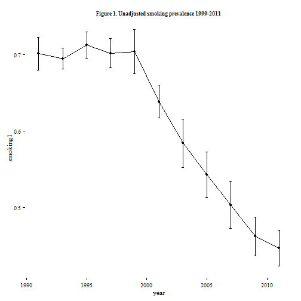
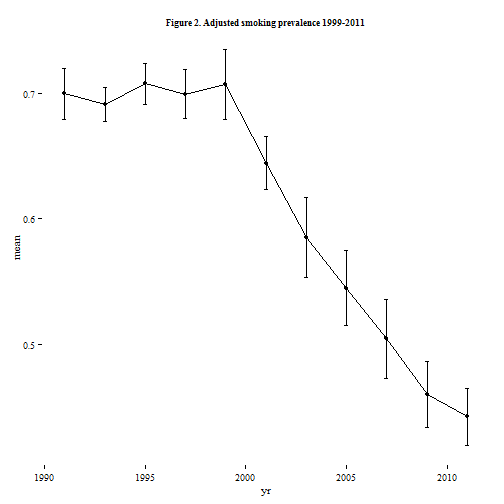
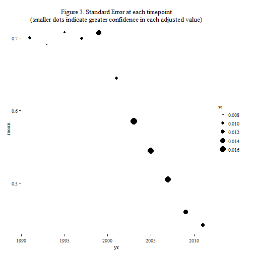

guest post by my friend [thomas yokota](mailto:thomasyokota@gmail.com), an oahu-based epidemiologist.  palmero professor [vito muggeo](mailto:vito.muggeo@unipa.it) wrote the joinpoint analysis section of the code below to demonstrate that [the `segmented` package](https://cran.r-project.org/web/packages/segmented/index.html) eliminates the need for [external (registration-only, windows-only, workflow-disrupting) software](http://surveillance.cancer.gov/joinpoint/download.html).  [`survey` package](http://r-survey.r-forge.r-project.org/survey/) creator and professor [thomas lumley](t.lumley@auckland.ac.nz) wrote [the `svypredmarg` function](https://gist.github.com/tslumley/2e74cd0ac12a671d2724) for us to replicate SUDAAN's `PREDMARG` command and match the cdc to the decimal.  [richard lowry, m.d.](mailto:rxl1@cdc.gov) at the centers for disease control & prevention wrote [the original linear trend analysis](http://www.cdc.gov/healthyyouth/yrbs/pdf/yrbs_conducting_trend_analyses.pdf) and then answered our infinite questions.  thanks to everyone.


-----
&nbsp;  


The purpose of this analysis is to make statistically valid statements such as, *"there was a significant linear decrease in the prevalence of high school aged americans who have ever smoked a cigarette across the period 1999-2011"* with complex sample survey data.

This step-by-step walkthrough exactly reproduces the statistics presented in the [Center for Disease Control & Prevention's (CDC) linear trend analysis](http://www.cdc.gov/healthyyouth/yrbs/pdf/yrbs_conducting_trend_analyses.pdf), using free and open source methods rather than proprietary or restricted software.

The example below displays only linearized designs (created with [the `svydesign` function](http://r-survey.r-forge.r-project.org/survey/html/svydesign.html)).  For more detail about how to reproduce this analysis with a replicate-weighted design (created with [the `svrepdesign` function](http://r-survey.r-forge.r-project.org/survey/html/svrepdesign.html)), see the methods note below section #4.

-----
&nbsp;  
### (1) Data Importation
Prior to running this analysis script, the Youth Risk Behavioral Surveillance System (YRBSS) 1991-2011 single-year files must all be loaded as R data files (.rda) on your local machine.  Running the download automation script will create the appropriate files.  If you need assistance with the data-loading step, first review [the main YRBSS blog post](http://www.asdfree.com/search/label/youth%20risk%20behavior%20surveillance%20system%20%28yrbss%29).


```r
# setInternet2( FALSE )		# # only windows users need this line
# library(downloader)
# setwd( "C:/My Directory/YRBSS/" )
# source_url( "https://raw.github.com/ajdamico/asdfree/master/Youth%20Risk%20Behavior%20Surveillance%20System/download%20all%20microdata.R" , prompt = FALSE , echo = TRUE )
```

-----
&nbsp;  
### (2) Load Required Packages, Options, External Functions


```r
# remove the # in order to run this install.packages line only once
# install.packages( c( "segmented" , "downloader" , "plyr" , "survey" , "ggplot2" , "ggthemes" , "texreg" ) )

# Muggeo V. (2008) Segmented: an R package to fit regression models with broken-line relationships. R News, 8, 1: 20-25.
library(segmented)	# determine segmented relationships in regression models

library(downloader)	# downloads and then runs the source() function on scripts from github
library(plyr) 		# contains the rbind.fill() function, which stacks two data frames even if they don't contain the same columns.  the rbind() function does not do this
library(survey) 	# load survey package (analyzes complex design surveys)
library(ggplot2)	# load ggplot2 package (plots data according to the grammar of graphics)
library(ggthemes)	# load extra themes, scales, and geoms for ggplot2
library(texreg)		# converts output to latex tables		

# set R to produce conservative standard errors instead of crashing
# http://r-survey.r-forge.r-project.org/survey/exmample-lonely.html
options( survey.lonely.psu = "adjust" )
# this setting matches the MISSUNIT option in SUDAAN
# SAS uses "remove" instead of "adjust" by default,
# the table target replication was generated with SAS,
# so if you want to get closer to that, use "remove"


# load dr. thomas lumley's `svypredmeans` function, which replicates SUDAAN's PREDMARG command
source_url( "https://gist.githubusercontent.com/tslumley/2e74cd0ac12a671d2724/raw/0f5feeb68118920532f5b7d67926ec5621d48975/svypredmeans.R" , prompt = FALSE , quiet = TRUE )
```

For more detail about `svypredmeans`, see https://gist.github.com/tslumley/2e74cd0ac12a671d2724.


-----
&nbsp;  
### (3) Harmonize and Stack Multiple Years of Survey Data

This step is clearly dataset-specific.  In order for your trend analysis to work, you'll need to figure out how to align the variables from multiple years of data into a trendable, stacked `data.frame` object.


```r
# initiate an empty `y` object
y <- NULL

# loop through each year of YRBSS microdata
for ( year in seq( 1991 , 2011 , 2 ) ){

	# load the current year
	load( paste0( "yrbs" , year , ".rda" ) )
	
	# tack on a `year` column
	x$year <- year
	
	# stack that year of data alongside the others,
	# ignoring mis-matching columns
	y <- rbind.fill( x , y )
	
	# clear the single-year of microdata from RAM
	rm( x )
	
}

# remove all unnecessary columns from the 1991-2011 multi-year stack
y <- y[ c( "q2" , "q3" , "q4" , "q23" , "q26" , "q27" , "q28" , "q29" , "year" , "psu" , "stratum" , "weight" , "raceeth" ) ]

# convert every column to numeric type
y[ , ] <- sapply( y[ , ] , as.numeric )

# construct year-specific recodes so that
# "ever smoked a cigarette" // grade // sex // race-ethnicity align across years
y <-
	transform(
		
		y ,
		
		smoking = 
			as.numeric(
				ifelse( year == 1991 , q23 ,
				ifelse( year %in% c( 1993 , 2001:2009 ) , q28 ,
				ifelse( year %in% 1995:1997 , q26 ,
				ifelse( year %in% 1999 , q27 ,
				ifelse( year %in% 2011 , q29 , NA ) ) ) ) ) 
			) ,
				
		raceeth = 
			
			ifelse( year %in% 1991:1997 ,
				ifelse( q4 %in% 1:3 , q4 , ifelse( q4 %in% 4:6 , 4 , NA ) ) ,
			
			ifelse( year %in% 1999:2005 ,
				ifelse( q4 %in% 6 , 1 ,
				ifelse( q4 %in% 3 , 2 ,
				ifelse( q4 %in% c( 4 , 7 ) , 3 ,
				ifelse( q4 %in% c( 1 , 2 , 5 , 8 ) , 4 , NA ) ) ) ) ,
				
			ifelse( year %in% 2007:2011 ,
				ifelse( raceeth %in% 5 , 1 ,
				ifelse( raceeth %in% 3 , 2 ,
				ifelse( raceeth %in% c( 6 , 7 ) , 3 ,
				ifelse( raceeth %in% c( 1 , 2 , 4 , 8 ) , 4 , NA ) ) ) ) ,
				
				NA ) ) ) ,
				
		grade = ifelse( q3 == 5 , NA , as.numeric( q3 ) ) ,
		
		sex = ifelse( q2 %in% 1:2 , q2 , NA )
		
	)
	

# again remove unnecessary variables, keeping only the complex sample survey design columns
# plus independent/dependent variables to be used in the regression analyses
y <- y[ c( "year" , "psu" , "stratum" , "weight" , "smoking" , "raceeth" , "sex" , "grade" ) ]

# set female to the reference group
y$sex <- relevel( factor( y$sex ) , ref = "2" )

# set ever smoked=yes // white // 9th graders as the reference groups
for ( i in c( 'smoking' , 'raceeth' , 'grade' ) ) y[ , i ] <- relevel( factor( y[ , i ] ) , ref = "1" )
```


-----
&nbsp;  
### (4) Construct a Multi-Year Stacked Complex Survey Design Object

Before constructing a multi-year stacked design object, check out `?contr.poly` - this function implements polynomials used in our trend analysis during step #6.  For more detail on this subject, see [page 216 of Applied Multiple Regression/Correlation Analysis for the Behavioral Sciences](https://www.google.com/search?q=The+polynomials+we+have+used+as+predictors+to+this+point+are+natural+polynomials%2C+generated+from+the+linear+predictor+by+centering+and+the+powering+the+linear+predictor.&ie=utf-8&oe=utf-8) By Jacob Cohen, Patricia Cohen, Stephen G. West, Leona S. Aiken *"The polynomials we have used as predictors to this point are natural polynomials, generated from the linear predictor by centering and the powering the linear predictor."*


```r
# extract a linear contrast vector of length eleven,
# because we have eleven distinct years of yrbss data `seq( 1999 , 2011 , 2 )`
c11l <- contr.poly( 11 )[ , 1 ]

# also extract a quadratic (squared) contrast vector
c11q <- contr.poly( 11 )[ , 2 ]

# just in case, extract a cubic contrast vector
c11c <- contr.poly( 11 )[ , 3 ]

# for each record in the data set, tack on the linear, quadratic, and cubic contrast value
# these contrast values will serve as replacement for the linear `year` variable in any regression.

# year^1 term (linear)
y$t11l <- c11l[ match( y$year , seq( 1999 , 2011 , 2 ) ) ]

# year^2 term (quadratic)
y$t11q <- c11q[ match( y$year , seq( 1999 , 2011 , 2 ) ) ]

# year^3 term (cubic)
y$t11c <- c11c[ match( y$year , seq( 1999 , 2011 , 2 ) ) ]

# construct a complex sample survey design object
# stacking multiple years and accounting for `year` in the nested strata
des <- 
	svydesign(
		id = ~psu , 
		strata = ~interaction( stratum , year ) ,
		data = y , 
		weights = ~weight , 
		nest = TRUE
	)
```


Now we've got a multi-year stack of complex survey designs with linear, quadratic, and cubic contrast values appended.  If you'd like more detail about stacking multiple years of complex survey data, review [the CDC's manual](http://www.cdc.gov/healthyyouth/yrbs/pdf/yrbs_combining_data.pdf) on the topic.  Hopefully we won't need anything beyond cubic, but let's find out.

-----
&nbsp;  
**Methods note** about how to stack replication designs: This is only relevant if you are trying to create a `des` like the object above but just have replicate weights and do not have the clustering information (psu).  It is straightforward to construct a replication design *from* a linearized design (see [`as.svrepdesign`](http://r-survey.r-forge.r-project.org/survey/html/as.svrepdesign.html)).  However, [for privacy reasons, going in the opposite direction is much more challenging](http://www.asdfree.com/2014/09/how-to-provide-variance-calculation-on.html).  Therefore, you'll need to do some dataset-specific homework on how to best *stack* multiple years of a replicate-weighted design you construct a multiple-year-stacked survey design like the object above.

If you'd like to experiment with how the two approaches differ (theoretically, very little), these publicly-available survey data sets include both replicate weights and, separately, clustering information:

[Medical Expenditure Panel Survey](http://www.asdfree.com/search/label/medical%20expenditure%20panel%20survey%20%28meps%29)  
[National Health and Nutrition Examination Survey](http://www.asdfree.com/search/label/national%20health%20and%20nutrition%20examination%20survey%20%28nhanes%29)  
[Consumer Expenditure Survey](http://www.asdfree.com/search/label/consumer%20expenditure%20survey%20%28ce%29)  

In most cases, omitting the `year` variable from the `strata = ~interaction( stratum , year )` construction of `des` above will make your standard errors larger (conservative) -> ergo -> you can probably just `rbind( file_with_repweights_year_one , file_with_repweights_year_two , ... )` so long as the survey design has not changed in structure over the time period that you are analyzing.  Once you have the rbound replicate weights object for every year, you could just construct one huge multi-year `svrepdesign` object. Make sure you include `scale`, `rscales`, `rho`, and whatever else the `svrepdesign()` call asks for.  If you are worried you missed something, check `attributes( your_single_year_replication_design_object )`.  This solution is likely to be a decent approach in most cases.

If you need to be very conservative with your computation of trend statistical significance, you might attempt to re-construct fake clusters for yourself using a regression.  Search for "malicious" in [this confidentiality explanation document](https://github.com/ajdamico/asdfree/blob/master/Confidentiality/how%20to%20create%20de-identified%20replicate%20weights.R).  The purpose here, though, isn't to identify individual respondents in the dataset, it's to get a variable like `psu` above that gives you reasonable standard errors.  Look for the object `your.replicate.weights` in that script.  You could reconstruct a fake psu for each record in your data set with something as easy as..


```r
# fake_psu should be a one-record-per-person vector object
# that can immediately be appended onto your data set.
fake_psu <- kmeans( your.replicate.weights , 20 )
```
..where 20 is the (completely made up) number of clusters x strata.  Hopefully the methodology documents (or the people who wrote them) will at least tell you how many clusters there were in the original sample, even if the clusters themselves were not disclosed.  At the point you've made fake clusters, they will surely be worse than the real clusters (i.e. conservative standard errors) and you can construct a multiple-year survey design with:


```r
des <- svydesign( id = ~ your_fake_psus , strata = ~ year , data = y , weights = ~ weight , nest = TRUE )
```

This approach will probably be conservative probably.

-----
&nbsp;  
### (5) Review the unadjusted results
Here's the change over time for smoking prevalence among youth. Unadjusted prevalence rates (Figure 1) suggest a significant change in smoking prevalence.


```r
# immediately remove records with missing smoking status
des_ns <- subset( des , !is.na( smoking ) )

# calculate unadjusted, un-anythinged "ever smoked" rates by year
# note that this reproduces the unadjusted "ever smoked" statistics at the top of
# pdf page 6 of http://www.cdc.gov/healthyyouth/yrbs/pdf/yrbs_conducting_trend_analyses.pdf
unadjusted <- svyby( ~ smoking , ~ year , svymean , design = des_ns , vartype = c( 'ci' , 'se' ) )

# coerce that result into a `data.frame` object
my_plot <- data.frame( unadjusted )

# plot the unadjusted decline in smoking
ggplot( my_plot , aes( x = year, y = smoking1 ) ) +
  geom_point() + 
  geom_errorbar( aes( ymax = ci_u.smoking1 , ymin = ci_l.smoking1 ) , width = .2 ) +
  geom_line() +
  theme_tufte() +
  ggtitle( "Figure 1. Unadjusted smoking prevalence 1999-2011" ) +
  theme( plot.title = element_text( size = 9 , face = "bold" ) )
```

 


-----
&nbsp;  
### (6) Calculate the Number of Joinpoints Needed

Using the orthogonal coefficients (linear, quadratic, cubic terms) that we previously added to our `data.frame` object before constructing the multi-year stacked survey design, let's now determine how many joinpoints will be needed for a trend analysis.

Epidemiological models typically control for possible confounding variables such as sex and race, so let's add them in with the linear, cubic, and quadratic year terms.

Calculate the "ever smoked" binomial regression, adjusted by sex, age, race-ethnicity, and a linear year contrast.


```r
linyear <- 
	svyglm(
		I( smoking == 1 ) ~ sex + raceeth + grade + t11l , 
		design = subset( des_ns , smoking %in% 1:2 ) , 
		family = quasibinomial
	)

summary( linyear )
```

```
## 
## Call:
## svyglm(formula = I(smoking == 1) ~ sex + raceeth + grade + t11l, 
##     design = subset(des_ns, smoking %in% 1:2), family = quasibinomial)
## 
## Survey design:
## subset(des_ns, smoking %in% 1:2)
## 
## Coefficients:
##             Estimate Std. Error t value Pr(>|t|)    
## (Intercept) -0.41445    0.04563  -9.083  < 2e-16 ***
## sex1        -0.09318    0.02326  -4.005 7.99e-05 ***
## raceeth2    -0.05605    0.04929  -1.137  0.25647    
## raceeth3     0.19022    0.04298   4.426 1.39e-05 ***
## raceeth4    -0.14977    0.05298  -2.827  0.00505 ** 
## grade2       0.26058    0.03134   8.314 4.41e-15 ***
## grade3       0.39964    0.03708  10.779  < 2e-16 ***
## grade4       0.65188    0.03893  16.744  < 2e-16 ***
## t11l        -1.96550    0.11439 -17.183  < 2e-16 ***
## ---
## Signif. codes:  0 '***' 0.001 '**' 0.01 '*' 0.05 '.' 0.1 ' ' 1
## 
## (Dispersion parameter for quasibinomial family taken to be 1.002984)
## 
## Number of Fisher Scoring iterations: 4
```

The linear year-contrast variable `t11l` is hugely significant here.  Therefore, there is probably going to be some sort of trend.  A linear trend does not need joinpoints.  Not one, just zero joinpoints.  If the linear term were the only significant term (out of linear, quadratic, cubic, etc.), then we would not need to calculate a joinpoint.  In other words, we would not need to figure out where to best break our time trend into two, three, or even four segments.

The linear trend is significant, so we should keep going.

-----
&nbsp;  

**The linear term `t11l` was significant, so we probably have a significant linear trend somewhere to report.  Now we need to figure out when that significant linear trend started and ended.  It might be semantically true that there was a significant linear decrease in high school aged smoking over the entire period of our data 1991-2011; however, it's inexact, unrefined to give up after only detecting a linear trend.  The purpose of the following few steps is really to *cordon off* different time points from one another.  As you'll see later, there actually was not any detectable decrease from 1991-1999.  The entirety of the decline in smoking occurred over the period from 1999-2011.  So these next (methodologically tricky) steps serve to provide you and your audience with a more precise statement of statistical significance.  It's not technically wrong to conclude that smoking declined over the period of 1991-2011, it's just verbose.**

-----
&nbsp;  

Calculate the "ever smoked" binomial regression, adjusted by sex, age, race-ethnicity, and both linear and quadratic year contrasts.  Notice the addition of `t11q`.


```r
quadyear <-
	svyglm(
		I( smoking == 1 ) ~ sex + raceeth + grade + t11l + t11q , 
		design = subset( des_ns , smoking %in% 1:2 ) , 
		family = quasibinomial 
	)

summary( quadyear )
```

```
## 
## Call:
## svyglm(formula = I(smoking == 1) ~ sex + raceeth + grade + t11l + 
##     t11q, design = subset(des_ns, smoking %in% 1:2), family = quasibinomial)
## 
## Survey design:
## subset(des_ns, smoking %in% 1:2)
## 
## Coefficients:
##             Estimate Std. Error t value Pr(>|t|)    
## (Intercept) -0.23972    0.07854  -3.052  0.00250 ** 
## sex1        -0.09288    0.02327  -3.991 8.45e-05 ***
## raceeth2    -0.05566    0.04935  -1.128  0.26037    
## raceeth3     0.19094    0.04253   4.489 1.06e-05 ***
## raceeth4    -0.16106    0.05307  -3.035  0.00264 ** 
## grade2       0.26041    0.03139   8.297 5.03e-15 ***
## grade3       0.39890    0.03716  10.736  < 2e-16 ***
## grade4       0.65077    0.03897  16.700  < 2e-16 ***
## t11l        -1.24235    0.28336  -4.384 1.66e-05 ***
## t11q         0.51001    0.19710   2.588  0.01019 *  
## ---
## Signif. codes:  0 '***' 0.001 '**' 0.01 '*' 0.05 '.' 0.1 ' ' 1
## 
## (Dispersion parameter for quasibinomial family taken to be 1.003261)
## 
## Number of Fisher Scoring iterations: 4
```
The linear year-contrast variable is hugely significant here but the quadratic year-contrast variable is also significant.  Therefore, we should use joinpoint software for this analysis.  A significant quadratic trend needs one joinpoint.

Since both linear and quadratic terms are significant, we should move ahead and test whether the cubic term is also significant.

Calculate the "ever smoked" binomial regression, adjusted by sex, age, race-ethnicity, and linear, quadratic, and cubic year contrasts.  Notice the addition of `t11c`.

```r
cubyear <-
	svyglm(
		I( smoking == 1 ) ~ sex + raceeth + grade + t11l + t11q + t11c , 
		design = subset( des_ns , smoking %in% 1:2 ) , 
		family = quasibinomial 
	)
	
summary( cubyear )
```

```
## 
## Call:
## svyglm(formula = I(smoking == 1) ~ sex + raceeth + grade + t11l + 
##     t11q + t11c, design = subset(des_ns, smoking %in% 1:2), family = quasibinomial)
## 
## Survey design:
## subset(des_ns, smoking %in% 1:2)
## 
## Coefficients:
##             Estimate Std. Error t value Pr(>|t|)    
## (Intercept) -0.28320    0.21756  -1.302  0.19412    
## sex1        -0.09284    0.02325  -3.993 8.41e-05 ***
## raceeth2    -0.05593    0.04944  -1.131  0.25899    
## raceeth3     0.19099    0.04253   4.490 1.05e-05 ***
## raceeth4    -0.16157    0.05350  -3.020  0.00277 ** 
## grade2       0.26036    0.03137   8.299 4.99e-15 ***
## grade3       0.39884    0.03715  10.734  < 2e-16 ***
## grade4       0.65072    0.03897  16.700  < 2e-16 ***
## t11l        -1.43510    0.96744  -1.483  0.13913    
## t11q         0.36885    0.70758   0.521  0.60260    
## t11c        -0.06335    0.31997  -0.198  0.84320    
## ---
## Signif. codes:  0 '***' 0.001 '**' 0.01 '*' 0.05 '.' 0.1 ' ' 1
## 
## (Dispersion parameter for quasibinomial family taken to be 1.003279)
## 
## Number of Fisher Scoring iterations: 4
```
The cubic year-contrast term is *not* significant in this model.  Therefore, we should stop testing the shape of this line.  In other words, we can stop at a quadratic trend and *do not* need a cubic trend.  That means we can stop at a single joinpoint.  Remember: a linear trend requires zero joinpoints, a quadratic trend requires one joinpoint, a cubic trend requires two, and on and on.

Note: if the cubic trend *were* significant, then we would increase the number of joinpoints to *two* instead of *one* but since the cubic term is not significant, we should stop with the previous regression.  If we keep getting significant trends, we ought to continue testing whether higher terms continue to be significant.  So `year^4` requires three joinpoints, `year^5` requires four joinpoints, and so on.  If these terms continued to be significant, we would need to return to step #4 and add additional `year^n` terms to the model.

Just for coherence's sake, let's assemble all of these results into a single table where you can see the linear, quadratic, and cubic models side-by-side.  The quadratic trend best describes the relationship between prevalence of smoking and change-over-time. The decision to test beyond linear trends, however, is a decision for the individual researcher to make. It is a decision that can be driven by theoretical issues, existing literature, or the availability of data.
<center>

<table cellspacing="0" style="border: none;">
<caption align="bottom" style="margin-top:0.3em;">Table 1. Testing for linear trends</caption>
<tr>
<th style="text-align: left; border-top: 2px solid black; border-bottom: 1px solid black; padding-right: 12px;"></th>
<th style="text-align: left; border-top: 2px solid black; border-bottom: 1px solid black; padding-right: 12px;"><b>Model 1</b></th>
<th style="text-align: left; border-top: 2px solid black; border-bottom: 1px solid black; padding-right: 12px;"><b>Model 2</b></th>
<th style="text-align: left; border-top: 2px solid black; border-bottom: 1px solid black; padding-right: 12px;"><b>Model 3</b></th>
</tr>
<tr>
<td style="padding-right: 12px; border: none;">(Intercept)</td>
<td style="padding-right: 12px; border: none;">-0.41 (0.05)<sup style="vertical-align: 0px;">***</sup></td>
<td style="padding-right: 12px; border: none;">-0.24 (0.08)<sup style="vertical-align: 0px;">**</sup></td>
<td style="padding-right: 12px; border: none;">-0.28 (0.22)</td>
</tr>
<tr>
<td style="padding-right: 12px; border: none;">sex1</td>
<td style="padding-right: 12px; border: none;">-0.09 (0.02)<sup style="vertical-align: 0px;">***</sup></td>
<td style="padding-right: 12px; border: none;">-0.09 (0.02)<sup style="vertical-align: 0px;">***</sup></td>
<td style="padding-right: 12px; border: none;">-0.09 (0.02)<sup style="vertical-align: 0px;">***</sup></td>
</tr>
<tr>
<td style="padding-right: 12px; border: none;">raceeth2</td>
<td style="padding-right: 12px; border: none;">-0.06 (0.05)</td>
<td style="padding-right: 12px; border: none;">-0.06 (0.05)</td>
<td style="padding-right: 12px; border: none;">-0.06 (0.05)</td>
</tr>
<tr>
<td style="padding-right: 12px; border: none;">raceeth3</td>
<td style="padding-right: 12px; border: none;">0.19 (0.04)<sup style="vertical-align: 0px;">***</sup></td>
<td style="padding-right: 12px; border: none;">0.19 (0.04)<sup style="vertical-align: 0px;">***</sup></td>
<td style="padding-right: 12px; border: none;">0.19 (0.04)<sup style="vertical-align: 0px;">***</sup></td>
</tr>
<tr>
<td style="padding-right: 12px; border: none;">raceeth4</td>
<td style="padding-right: 12px; border: none;">-0.15 (0.05)<sup style="vertical-align: 0px;">**</sup></td>
<td style="padding-right: 12px; border: none;">-0.16 (0.05)<sup style="vertical-align: 0px;">**</sup></td>
<td style="padding-right: 12px; border: none;">-0.16 (0.05)<sup style="vertical-align: 0px;">**</sup></td>
</tr>
<tr>
<td style="padding-right: 12px; border: none;">grade2</td>
<td style="padding-right: 12px; border: none;">0.26 (0.03)<sup style="vertical-align: 0px;">***</sup></td>
<td style="padding-right: 12px; border: none;">0.26 (0.03)<sup style="vertical-align: 0px;">***</sup></td>
<td style="padding-right: 12px; border: none;">0.26 (0.03)<sup style="vertical-align: 0px;">***</sup></td>
</tr>
<tr>
<td style="padding-right: 12px; border: none;">grade3</td>
<td style="padding-right: 12px; border: none;">0.40 (0.04)<sup style="vertical-align: 0px;">***</sup></td>
<td style="padding-right: 12px; border: none;">0.40 (0.04)<sup style="vertical-align: 0px;">***</sup></td>
<td style="padding-right: 12px; border: none;">0.40 (0.04)<sup style="vertical-align: 0px;">***</sup></td>
</tr>
<tr>
<td style="padding-right: 12px; border: none;">grade4</td>
<td style="padding-right: 12px; border: none;">0.65 (0.04)<sup style="vertical-align: 0px;">***</sup></td>
<td style="padding-right: 12px; border: none;">0.65 (0.04)<sup style="vertical-align: 0px;">***</sup></td>
<td style="padding-right: 12px; border: none;">0.65 (0.04)<sup style="vertical-align: 0px;">***</sup></td>
</tr>
<tr>
<td style="padding-right: 12px; border: none;">t11l</td>
<td style="padding-right: 12px; border: none;">-1.97 (0.11)<sup style="vertical-align: 0px;">***</sup></td>
<td style="padding-right: 12px; border: none;">-1.24 (0.28)<sup style="vertical-align: 0px;">***</sup></td>
<td style="padding-right: 12px; border: none;">-1.44 (0.97)</td>
</tr>
<tr>
<td style="padding-right: 12px; border: none;">t11q</td>
<td style="padding-right: 12px; border: none;"></td>
<td style="padding-right: 12px; border: none;">0.51 (0.20)<sup style="vertical-align: 0px;">*</sup></td>
<td style="padding-right: 12px; border: none;">0.37 (0.71)</td>
</tr>
<tr>
<td style="padding-right: 12px; border: none;">t11c</td>
<td style="padding-right: 12px; border: none;"></td>
<td style="padding-right: 12px; border: none;"></td>
<td style="padding-right: 12px; border: none;">-0.06 (0.32)</td>
</tr>
<tr>
<td style="border-top: 1px solid black;">Deviance</td>
<td style="border-top: 1px solid black;">129236.34</td>
<td style="border-top: 1px solid black;">129154.91</td>
<td style="border-top: 1px solid black;">129154.45</td>
</tr>
<tr>
<td style="padding-right: 12px; border: none;">Dispersion</td>
<td style="padding-right: 12px; border: none;">1.00</td>
<td style="padding-right: 12px; border: none;">1.00</td>
<td style="padding-right: 12px; border: none;">1.00</td>
</tr>
<tr>
<td style="border-bottom: 2px solid black;">Num. obs.</td>
<td style="border-bottom: 2px solid black;">96973</td>
<td style="border-bottom: 2px solid black;">96973</td>
<td style="border-bottom: 2px solid black;">96973</td>
</tr>
<tr>
<td style="padding-right: 12px; border: none;" colspan="4"><span style="font-size:0.8em"><sup style="vertical-align: 0px;">***</sup>p &lt; 0.001, <sup style="vertical-align: 0px;">**</sup>p &lt; 0.01, <sup style="vertical-align: 0px;">*</sup>p &lt; 0.05</span></td>
</tr>
</table>
</center>

-----
&nbsp;  
### (7) Calculate the Adjusted Prevalence and Predicted Marginals

First, calculate the survey-year-independent predictor effects and store these results into a separate object.


```r
marginals <- 
	svyglm(
		formula = I( smoking == 1 ) ~ sex + raceeth + grade ,
		design = des_ns , 
		family = quasibinomial
	)
```

Second, run these marginals through the `svypredmeans` function written by Dr. Thomas Lumley.  For any archaeology fans out there, this function emulates the `PREDMARG` statement in the ancient language of SUDAAN.

```r
( means_for_joinpoint <- svypredmeans( marginals , ~factor( year ) ) )
```

```
##         mean     SE
## 2011 0.44204 0.0117
## 2009 0.45981 0.0133
## 2007 0.50443 0.0160
## 2005 0.54455 0.0152
## 2003 0.58499 0.0163
## 2001 0.64415 0.0107
## 1999 0.70705 0.0142
## 1997 0.69934 0.0101
## 1995 0.70731 0.0085
## 1993 0.69080 0.0070
## 1991 0.69968 0.0103
```

Finally, clean up these results a bit in preparation for a joinpoint analysis.

```r
# coerce the results to a data.frame object
means_for_joinpoint <- as.data.frame( means_for_joinpoint )

# extract the row names as the survey year
means_for_joinpoint$year <- as.numeric( rownames( means_for_joinpoint ) )

# must be sorted, just in case it's not already
means_for_joinpoint <- means_for_joinpoint[ order( means_for_joinpoint$year ) , ]

# rename columns so they do not conflict with variables in memory
names( means_for_joinpoint ) <- c( 'mean' , 'se' , 'yr' )
# the above line is only because the ?segmented function (used below)
# does not work if an object of the same name is also in memory.

another_plot <- means_for_joinpoint
another_plot$ci_l.mean <- another_plot$mean - (1.96 * another_plot$se)
another_plot$ci_u.mean <- another_plot$mean + (1.96 * another_plot$se)

ggplot(another_plot, aes(x = yr, y = mean)) +
  geom_point() + 
  geom_errorbar(aes(ymax = ci_u.mean, ymin = ci_l.mean), width=.2) +
  geom_line() +
  theme_tufte() +
  ggtitle("Figure 2. Adjusted smoking prevalence 1999-2011") +
  theme(plot.title = element_text(size=9, face="bold"))
```

 


-----
&nbsp;  
### (8) Identify the Breakpoint/Changepoint

The original CDC analysis recommended some [external software from the National Cancer Institute](http://surveillance.cancer.gov/joinpoint/), which only runs on selected platforms. Dr. Vito Muggeo wrote this within-R solution using his [segmented](https://cran.r-project.org/web/packages/segmented/index.html) package available on CRAN.  Let's take a look at how confident we are in the value at each adjusted timepoint.  Carrying out a trend analysis requires creating new weights to fit a piecewise linear regression. Figure 3 shows the relationship between variance at each datum and weighting.  Larger circles display greater uncertainty and therefore lower weight.


```r
ggplot( means_for_joinpoint , aes( x = yr , y = mean ) ) +
	geom_point( aes( size = se ) ) +
	theme_tufte() +
	ggtitle( "Figure 3. Standard Error at each timepoint\n(smaller dots indicate greater confidence in each adjusted value)"
) 
```

 


First, create that weight variable.


```r
means_for_joinpoint$wgt <- with( means_for_joinpoint, ( mean / se ) ^ 2 ) 
```

Second, fit a piecewise linear regression.


```r
# estimate the 'starting' linear model with the usual "lm" function using the log values and the weights.
o <- lm( log( mean ) ~ yr , weights = wgt , data = means_for_joinpoint )
```

Now that the regression has been structured correctly, estimate the year that our complex survey trend should be broken into two segments (the changepoint/breakpoint/joinpoint).


```r
# add a segmented variable (`yr` in this example) with 1 breakpoint
os <- segmented( o , ~yr )

# `os` is now a `segmented` object, which means it includes information on the fitted model,
# such as parameter estimates, standard errors, residuals.
summary( os )
```

```
## 
## 	***Regression Model with Segmented Relationship(s)***
## 
## Call: 
## segmented.lm(obj = o, seg.Z = ~yr)
## 
## Estimated Break-Point(s):
##      Est.   St.Err 
## 1998.719    0.387 
## 
## Meaningful coefficients of the linear terms:
##              Estimate Std. Error t value Pr(>|t|)
## (Intercept) -4.720786   4.728729  -0.998    0.351
## yr           0.002188   0.002372   0.922    0.387
## U1.yr       -0.042164   0.002899 -14.543       NA
## 
## Residual standard error: 0.7539 on 7 degrees of freedom
## Multiple R-Squared: 0.9936,  Adjusted R-squared: 0.9909 
## 
## Convergence attained in 2 iterations with relative change 2.442197e-16
```

See the `Estimated Break-Point(s)` in that result?  That's the critical number from this joinpoint analysis.

Note that the above number is not an integer! The [R `segmented` package](https://cran.r-project.org/web/packages/segmented/index.html) uses an iterative procedure (described in the article below) and therefore between-year solutions are returned.  The joinpoint software implements two estimating algorithms: the grid-search and the Hudson algorithm.  For more detail about these methods, see [Muggeo V. (2003) Estimating regression models with unknown break-points. Statistics in Medicine, 22: 3055-3071.](http://onlinelibrary.wiley.com/doi/10.1002/sim.1545/abstract).


```r
# figuring out the breakpoint year was the purpose of this joinpoint analysis.
( your_breakpoint <- round( as.vector( os$psi[, "Est." ] ) ) )
```

```
## [1] 1999
```

```r
# so.  that's a joinpoint.  that's where the two line segments join.  okay?

# obtain the annual percent change (APC=) estimates for each time point
slope( os , APC = TRUE )
```

```
## $yr
##          Est. CI(95%).l CI(95%).u
## slope1  0.219   -0.3414    0.7826
## slope2 -3.919   -4.2970   -3.5390
```

The returned CIs for the annual percent change (APC) may be different from the ones returned by [NCI's Joinpoint Software](surveillance.cancer.gov/joinpoint/); for further details, check out [Muggeo V. (2010) A Comment on `Estimating average annual per cent change in trend analysis' by Clegg et al., Statistics in Medicine; 28, 3670-3682. Statistics in Medicine, 29, 1958-1960.](http://onlinelibrary.wiley.com/doi/10.1002/sim.3850/abstract)

This analysis returned similar results to the NCI's Joinpoint Regression Program by estimating a changepoint at `year=1999` - and, more precisely, that the start of that decreasing trend in smoking prevalence happened at an APC of -3.92 percent.  That is, `slope2` from the output above.

-----
&nbsp;  
### (9) Make statistically defensible statements about linear trends with complex survey data

After identifying the change point for smoking prevalence, we can create two regression models (one for each time segment).  (If we had two joinpoints, we would need three regression models.)  The first model covers the years leading up to (and including) the changepoint (i.e., 1991 to 1999).  The second model includes the years from the changepoint forward (i.e., 1999 to 2011).  So start with 1991, 1993, 1995, 1997, 1999, the five year-points before (and including 1999).


```r
# calculate a five-timepoint linear contrast vector
c5l <- contr.poly( 5 )[ , 1 ]

# tack the five-timepoint linear contrast vectors onto the current survey design object
des_ns <- update( des_ns , t5l = c5l[ match( year , seq( 1991 , 1999 , 2 ) ) ] )

pre_91_99 <-
	svyglm(
		I( smoking == 1 ) ~ sex + raceeth + grade + t5l ,
		design = subset( des_ns , smoking %in% 1:2 & year <= 1999 ) , 
		family = quasibinomial
	)

summary( pre_91_99 )
```

```
## 
## Call:
## svyglm(formula = I(smoking == 1) ~ sex + raceeth + grade + t5l, 
##     design = subset(des_ns, smoking %in% 1:2 & year <= 1999), 
##     family = quasibinomial)
## 
## Survey design:
## subset(des_ns, smoking %in% 1:2 & year <= 1999)
## 
## Coefficients:
##             Estimate Std. Error t value Pr(>|t|)    
## (Intercept)  0.61609    0.05003  12.314  < 2e-16 ***
## sex1        -0.05856    0.02935  -1.995 0.047310 *  
## raceeth2    -0.12437    0.05412  -2.298 0.022561 *  
## raceeth3     0.18418    0.04781   3.852 0.000156 ***
## raceeth4    -0.16265    0.06497  -2.503 0.013082 *  
## grade2       0.27785    0.04689   5.926 1.29e-08 ***
## grade3       0.36458    0.05606   6.503 5.85e-10 ***
## grade4       0.50805    0.06209   8.183 2.84e-14 ***
## t5l          0.03704    0.05784   0.640 0.522639    
## ---
## Signif. codes:  0 '***' 0.001 '**' 0.01 '*' 0.05 '.' 0.1 ' ' 1
## 
## (Dispersion parameter for quasibinomial family taken to be 0.9992789)
## 
## Number of Fisher Scoring iterations: 4
```

Reproduce the sentence on [pdf page 6 of the original document](http://www.cdc.gov/healthyyouth/yrbs/pdf/yrbs_conducting_trend_analyses.pdf#page=6).  **In this example, T5L_L had a p-value=0.52261 and beta=0.03704. Therefore, there was "no significant change in the prevalence of ever smoking a cigarette during 1991-1999."**


Then move on to 1999, 2001, 2003, 2005, 2007, 2009, and 2011, the seven year-points after (and including 1999).


```r
# calculate a seven-timepoint linear contrast vector
c7l <- contr.poly( 7 )[ , 1 ]

# tack the seven-timepoint linear contrast vectors onto the current survey design object
des_ns <- update( des_ns , t7l = c7l[ match( year , seq( 1999 , 2011 , 2 ) ) ] )

post_99_11 <-
	svyglm(
		I( smoking == 1 ) ~ sex + raceeth + grade + t7l ,
		design = subset( des_ns , smoking %in% 1:2 & year >= 1999 ) , 
		family = quasibinomial
	)
	
summary( post_99_11 )
```

```
## 
## Call:
## svyglm(formula = I(smoking == 1) ~ sex + raceeth + grade + t7l, 
##     design = subset(des_ns, smoking %in% 1:2 & year >= 1999), 
##     family = quasibinomial)
## 
## Survey design:
## subset(des_ns, smoking %in% 1:2 & year >= 1999)
## 
## Coefficients:
##             Estimate Std. Error t value Pr(>|t|)    
## (Intercept) -0.03964    0.04287  -0.925  0.35595    
## sex1        -0.09318    0.02326  -4.005 7.99e-05 ***
## raceeth2    -0.05605    0.04929  -1.137  0.25647    
## raceeth3     0.19022    0.04298   4.426 1.39e-05 ***
## raceeth4    -0.14977    0.05298  -2.827  0.00505 ** 
## grade2       0.26058    0.03134   8.314 4.41e-15 ***
## grade3       0.39964    0.03708  10.779  < 2e-16 ***
## grade4       0.65188    0.03893  16.744  < 2e-16 ***
## t7l         -0.99165    0.05771 -17.183  < 2e-16 ***
## ---
## Signif. codes:  0 '***' 0.001 '**' 0.01 '*' 0.05 '.' 0.1 ' ' 1
## 
## (Dispersion parameter for quasibinomial family taken to be 1.000677)
## 
## Number of Fisher Scoring iterations: 4
```


Reproduce the sentence on [pdf page 6 of the original document](http://www.cdc.gov/healthyyouth/yrbs/pdf/yrbs_conducting_trend_analyses.pdf#page=6).  **In this example, T7L_R had a p-value<0.0001 and beta=-0.99165. Therefore, there was a "significant linear decrease in the prevalence of ever smoking a cigarette during 1999-2011."**

Note also that the 1999-2011 time period saw a linear decrease, which supports the APC estimate in step #8.  Here's everything displayed as a single coherent table.

<center>


<table cellspacing="0" style="border: none;">
<caption align="bottom" style="margin-top:0.3em;">Table 2. Linear trends pre-post changepoint</caption>
<tr>
<th style="text-align: left; border-top: 2px solid black; border-bottom: 1px solid black; padding-right: 12px;"></th>
<th style="text-align: left; border-top: 2px solid black; border-bottom: 1px solid black; padding-right: 12px;"><b>Model 1</b></th>
<th style="text-align: left; border-top: 2px solid black; border-bottom: 1px solid black; padding-right: 12px;"><b>Model 2</b></th>
</tr>
<tr>
<td style="padding-right: 12px; border: none;">(Intercept)</td>
<td style="padding-right: 12px; border: none;">0.62 (0.05)<sup style="vertical-align: 0px;">***</sup></td>
<td style="padding-right: 12px; border: none;">-0.04 (0.04)</td>
</tr>
<tr>
<td style="padding-right: 12px; border: none;">sex1</td>
<td style="padding-right: 12px; border: none;">-0.06 (0.03)<sup style="vertical-align: 0px;">*</sup></td>
<td style="padding-right: 12px; border: none;">-0.09 (0.02)<sup style="vertical-align: 0px;">***</sup></td>
</tr>
<tr>
<td style="padding-right: 12px; border: none;">raceeth2</td>
<td style="padding-right: 12px; border: none;">-0.12 (0.05)<sup style="vertical-align: 0px;">*</sup></td>
<td style="padding-right: 12px; border: none;">-0.06 (0.05)</td>
</tr>
<tr>
<td style="padding-right: 12px; border: none;">raceeth3</td>
<td style="padding-right: 12px; border: none;">0.18 (0.05)<sup style="vertical-align: 0px;">***</sup></td>
<td style="padding-right: 12px; border: none;">0.19 (0.04)<sup style="vertical-align: 0px;">***</sup></td>
</tr>
<tr>
<td style="padding-right: 12px; border: none;">raceeth4</td>
<td style="padding-right: 12px; border: none;">-0.16 (0.06)<sup style="vertical-align: 0px;">*</sup></td>
<td style="padding-right: 12px; border: none;">-0.15 (0.05)<sup style="vertical-align: 0px;">**</sup></td>
</tr>
<tr>
<td style="padding-right: 12px; border: none;">grade2</td>
<td style="padding-right: 12px; border: none;">0.28 (0.05)<sup style="vertical-align: 0px;">***</sup></td>
<td style="padding-right: 12px; border: none;">0.26 (0.03)<sup style="vertical-align: 0px;">***</sup></td>
</tr>
<tr>
<td style="padding-right: 12px; border: none;">grade3</td>
<td style="padding-right: 12px; border: none;">0.36 (0.06)<sup style="vertical-align: 0px;">***</sup></td>
<td style="padding-right: 12px; border: none;">0.40 (0.04)<sup style="vertical-align: 0px;">***</sup></td>
</tr>
<tr>
<td style="padding-right: 12px; border: none;">grade4</td>
<td style="padding-right: 12px; border: none;">0.51 (0.06)<sup style="vertical-align: 0px;">***</sup></td>
<td style="padding-right: 12px; border: none;">0.65 (0.04)<sup style="vertical-align: 0px;">***</sup></td>
</tr>
<tr>
<td style="padding-right: 12px; border: none;">t5l</td>
<td style="padding-right: 12px; border: none;">0.04 (0.06)</td>
<td style="padding-right: 12px; border: none;"></td>
</tr>
<tr>
<td style="padding-right: 12px; border: none;">t7l</td>
<td style="padding-right: 12px; border: none;"></td>
<td style="padding-right: 12px; border: none;">-0.99 (0.06)<sup style="vertical-align: 0px;">***</sup></td>
</tr>
<tr>
<td style="border-top: 1px solid black;">Deviance</td>
<td style="border-top: 1px solid black;">83192.21</td>
<td style="border-top: 1px solid black;">128939.00</td>
</tr>
<tr>
<td style="padding-right: 12px; border: none;">Dispersion</td>
<td style="padding-right: 12px; border: none;">1.00</td>
<td style="padding-right: 12px; border: none;">1.00</td>
</tr>
<tr>
<td style="border-bottom: 2px solid black;">Num. obs.</td>
<td style="border-bottom: 2px solid black;">68769</td>
<td style="border-bottom: 2px solid black;">96973</td>
</tr>
<tr>
<td style="padding-right: 12px; border: none;" colspan="3"><span style="font-size:0.8em"><sup style="vertical-align: 0px;">***</sup>p &lt; 0.001, <sup style="vertical-align: 0px;">**</sup>p &lt; 0.01, <sup style="vertical-align: 0px;">*</sup>p &lt; 0.05</span></td>
</tr>
</table>
 
 </center>
 
-----
&nbsp;  
### Thanks

This analysis may complement qualitative evaluation on prevalence changes observed from surveillance data by providing quantitative evidence, such as when a change point occurred. This analysis does not explain why or how changes in trends occur.
